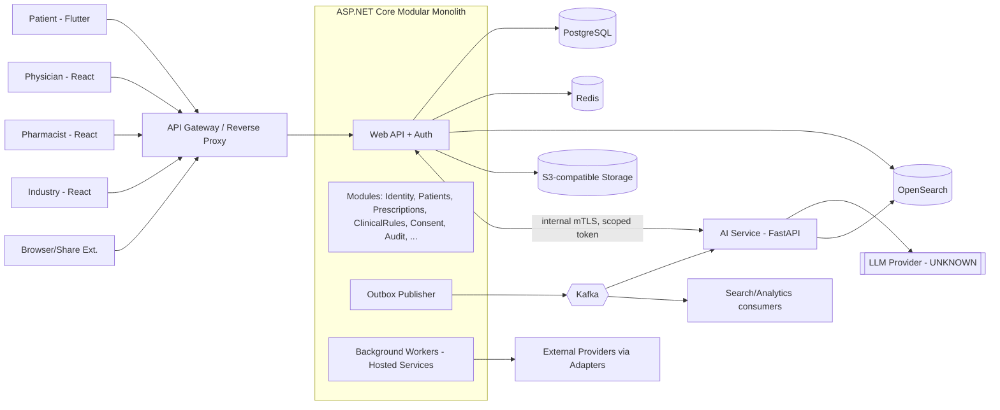

# 02 — System Architecture

## 1. اصول
1. Modular Monolith در MVP؛ مرز ماژول‌ها همان مرز آیندهٔ سرویس‌هاست.
2. Domain واحد بالینی در C# است؛ Python فقط برای «هوش» (LLM/RAG/Embedding/Ingestion).
3. AI Service **هیچ دسترسی مستقیم** به دیتابیس PHI ندارد؛ فقط از طریق Toolهای مجاز API با توکن محدود.
4. هر تغییر مهم = Domain Event → Outbox → (Kafka).
5. Security/Privacy/Audit از روز اول، نه بعداً.

## 2. Context Diagram


## 3. Stack و نقش
| لایه | فناوری | نقش | نکته |
|---|---|---|---|
| Backend | C# / ASP.NET Core (نسخهٔ LTS، **UNKNOWN** نسخهٔ دقیق) | Domain، API، Auth، Workers | Modular Monolith |
| AI | Python + FastAPI | RAG، Embedding، Orchestration، Eval، Ingestion | سرویس جدا (دلیل §6) |
| Web | TypeScript + React | Dashboard | |
| Mobile | Dart + Flutter | اپ بیمار | آفلاین-first برای Schedule |
| DB | PostgreSQL | منبع حقیقت | یک DB، schema به‌ازای ماژول |
| Cache | Redis | Session/Rate-limit/Cache/Lock | هیچ داده‌ای فقط در Redis نیست |
| Search | OpenSearch | جستجوی دارو (فازی/فارسی)، BM25 + k-NN برای RAG | D-19: pgvector در برابر OpenSearch k-NN |
| Broker | Kafka | رویدادها بین Core و AI/Indexer/Analytics | D-20: زمان ورود Kafka |
| Storage | S3-compatible | فایل‌های نسخه، منابع دانش، خروجی‌ها | SSE + Presigned URL کوتاه‌مدت |
| Container | Docker | | |
| CI/CD | GitHub Actions | Build/Test/SAST/Image scan | محیط استقرار: **UNKNOWN** (D-21) |

Orchestration (Kubernetes / VM / Managed): **UNKNOWN** (D-21). IaC: UNKNOWN.

## 4. Modular Monolith
### ساختار (پیشنهاد)
```
src/
  Host/                 # composition root، middleware، DI
  BuildingBlocks/       # Result, DomainEvent, Outbox, Clock, Abstractions
  Modules/<Name>/
    <Name>.Contracts    # تنها لایهٔ عمومی: DTO، Interface، Integration Events
    <Name>.Domain
    <Name>.Application
    <Name>.Infrastructure
    <Name>.Api          # Controllers/Minimal API endpoints
tests/ (Unit, Integration, Architecture, Contract, Security)
```
### قوانین مرز (با Architecture Test اجباری)
- ماژول فقط به `*.Contracts` ماژول دیگر وابسته می‌شود.
- **هیچ JOIN/FK بین schemaهای ماژول‌ها**؛ ارجاع با ID و بدون FK فیزیکی بین‌ماژولی (یا FK فقط در ماژول‌های هم‌خانواده – ذکر در سند ۰۴).
- هر ماژول فقط به schema خودش می‌نویسد (Role DB جدا در PostgreSQL).
- ارتباط sync: interface در Contracts. ارتباط async: Integration Event از Outbox.
- Transaction هرگز از مرز ماژول عبور نمی‌کند؛ سازگاری بین‌ماژولی eventual (Saga/Process Manager در صورت نیاز).

### الگوها
Clean/Onion داخل ماژول، CQRS سبک (بدون Event Sourcing جز Audit)، Outbox/Inbox برای idempotency،
Optimistic Concurrency (rowversion/xmin)، Soft-delete فقط با سیاست Retention.

## 5. Cross-cutting
- **AuthN**: OIDC-compatible token issuer داخل Identity (D-22: ساخت داخلی در برابر IdP بیرونی مثل Keycloak/…؛ **UNKNOWN**).
- **AuthZ**: Policy-based؛ Permission + ABAC evaluator مرکزی (سند ۰۶).
- **Audit**: middleware + domain hook؛ ثبت append-only.
- **Tenancy**: Pharmacy/Organization به‌عنوان مرز داده؛ multi-tenant منطقی (ستون OrganizationId + RLS PostgreSQL – پیشنهاد).
- **Observability**: OpenTelemetry، لاگ ساخت‌یافته با PHI-scrubber.
- **Config/Secrets**: Secret manager (UNKNOWN کدام)؛ هرگز در repo.
- **Feature flags**: برای قابلیت‌های AI و Integration.
- **API Versioning**: `/v1`، سیاست Deprecation.
- **Idempotency**: هدر `Idempotency-Key` برای POSTهای حساس.

## 6. کجا میکروسرویس (با دلیل فنی واقعی)
| سرویس | چرا جدا | چرا الان لازم است |
|---|---|---|
| **AI Service (Python/FastAPI)** | اکوسیستم ML فقط Python؛ مقیاس/منابع متفاوت (GPU/latency طولانی)؛ ایزوله‌سازی ریسک prompt-injection از Core | بله (در MVP) |
| **Knowledge Ingestion Worker (Python)** | پردازش سنگین PDF/OCR/Chunk/Embed، batch؛ همان stack AI | بله، می‌تواند بخشی از AI Service به‌صورت worker باشد |
| Integration Gateway | ایزوله‌سازی شبکه‌ای برای خروجی به سیستم‌های خارجی | **خیر** – فعلاً Module + egress proxy |
| Notification Dispatcher | مقیاس مستقل | **خیر** – Hosted Service؛ بازبینی بعد از Pilot |
| Analytics | بار خواندن سنگین | **خیر** – Read replica/OpenSearch؛ بازبینی بعد از Pilot |
| Identity | | **خیر** |

سایر ماژول‌ها در Monolith می‌مانند. معیار استخراج بعدی: نیاز مقیاس مستقل، تیم مستقل، یا مرز امنیتی سخت.

## 7. جریان‌های کلیدی
**نوشتن نسخه:** API → PrescriptionsModule (تراکنش + Outbox) → ClinicalRules.Check (sync، قطعی) →
Audit → Event `PrescriptionIssued` → Schedule/Notification/Search consumers.

**پرسش AI:** Client → Core `/ai/conversations/{id}/messages` (AuthZ+Consent+RateLimit+InputGuard) →
AI Service (Orchestrator) → Retrieval (OpenSearch) + Tools (فراخوانی Core با توکن محدود به همان کاربر/Consent) →
LLM → Output Guard → Core (ثبت Message/AIResponse/Audit) → Client (stream).
مدل امنیتی: AI Service *به‌جای* کاربر عمل می‌کند، نه با امتیاز بیشتر (on-behalf-of token).

## 8. Deployment (منطقی)
Environments: dev / staging / prod (+ جداسازی داده؛ داده واقعی در dev ممنوع).
Docker images: `core-api`, `core-worker`, `ai-service`, `ingestion-worker`, `web` (static). CI: build → unit → architecture tests →
SAST/Dependency/Secret scan → image scan → integration (Testcontainers) → deploy staging.
محل استقرار، Region، Managed vs Self-hosted: **UNKNOWN** (D-01, D-21).

## 9. ریسک‌های معماری
| ریسک | کاهش |
|---|---|
| Kafka برای MVP سنگین | Outbox از روز اول؛ Kafka با فلگ (D-20) |
| Drift مرز ماژول | Architecture tests در CI |
| نشت PHI به LLM Provider | Redaction/Tokenization، Provider قراردادی، D-17 |
| Consistency بین Postgres و OpenSearch | Outbox + reindex job |
| پیچیدگی ABAC | موتور Policy مرکزی + تست‌های ماتریسی |
