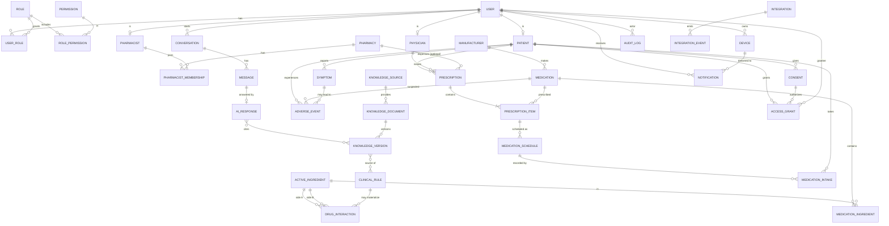

# 04 — Database Architecture (بدون SQL)

## 1. اصول
- PostgreSQL، **یک schema به‌ازای ماژول** (`identity`, `patients`, `rx`, `kb`, `rules`, `audit`, …) و Role دیتابیس جدا برای هر ماژول.
- PK: UUID (ترجیحاً time-ordered؛ نوع دقیق: تصمیم پیاده‌سازی). ارجاع بین‌ماژولی = ID بدون FK فیزیکی؛ یکپارچگی با رویداد/چک برنامه‌ای.
- ستون‌های استاندارد: `created_at, updated_at, created_by, row_version`؛ زمان‌ها UTC.
- **Row-Level Security** برای داده‌های Tenant (`organization_id`) و بیمار (پیشنهاد).
- رمزنگاری: TDE/دیسک + **Column-level (envelope) encryption** برای PHI پرحساس (یادداشت‌ها، علائم متنی آزاد، تصاویر) — کلیدها در KMS (**UNKNOWN**، D-21).
- Audit: جدول append-only؛ UPDATE/DELETE با Trigger/Privilege ممنوع؛ hash-chain؛ پارتیشن ماهانه.
- Retention: ستون `retention_class` + Job حذف/ناشناس‌سازی (سند ۰۷).
- Outbox/Inbox در هر schema.
- Soft-delete فقط برای موجودیت‌های غیر PHI؛ برای PHI «حذف/ناشناس‌سازی» طبق سیاست.
- Migration: ابزار (EF Core Migrations یا مشابه) — تصمیم در فاز ۱ (D-23). هر Migration Backward-compatible (expand/contract).
- دانش (KB): متن/ایندکس در OpenSearch + Object Storage؛ متادیتا و نسخه در Postgres.
- داده‌های تحلیلی: Read model جدا (schema `analytics`) با داده de-identified.

## 2. نگاشت Entity → ماژول (schema)
| Schema | Entities |
|---|---|
| identity | User، Role، Permission، UserRole، RolePermission، Device، (Session/MFA) |
| patients | Patient (+Allergy/Condition) |
| physicians | Physician |
| pharmacists | Pharmacist |
| pharmacies | Pharmacy، PharmacistMembership |
| meds | Medication، ActiveIngredient، MedicationIngredient، Manufacturer |
| rx | Prescription، PrescriptionItem |
| sched | MedicationSchedule |
| intake | MedicationIntake |
| symptoms | Symptom |
| adr | AdverseEvent |
| ai | Conversation، Message، AIResponse |
| kb | KnowledgeSource، KnowledgeDocument، KnowledgeVersion |
| rules | DrugInteraction، ClinicalRule |
| consent | Consent، AccessGrant |
| audit | AuditLog |
| notif | Notification (+Device ارجاع) |
| integ | Integration، IntegrationEvent |

> `Device` در Identity مالک است؛ Notifications فقط ارجاع می‌دهد.

## 3. ERD
ارتباط‌های منطقی (خط‌چین معنایی بین‌ماژولی = بدون FK فیزیکی؛ در مدل یکسان نشان داده شده است).

## 4. Entity Catalog (ستون‌های کلیدی، نه SQL)
`*` = ضروری. `[PHI]` حساس. `[ENC]` رمزنگاری ستونی.

| Entity | فیلدهای کلیدی | نکات |
|---|---|---|
| **User** | id*, status*, display_name, locale, email_hash/email[ENC?], phone, created_at, mfa_enabled | credentials در جدول جدا؛ هرگز log نشود |
| **Role** | id*, code*, name, scope (Global/Org) | |
| **Permission** | id*, code* (مثل `prescription.read`) | |
| (UserRole / RolePermission) | user_id, role_id, org_id? / role_id, permission_id | join |
| **Patient** | id*, user_id, birth_date[PHI], sex[PHI], allergies[PHI,ENC], conditions[PHI,ENC], pregnancy_status[PHI] | فیلدها با تأیید بالینی (D-06) |
| **Physician** | id*, user_id*, license_no, specialty, verification_status | تأیید: UNKNOWN |
| **Pharmacist** | id*, user_id*, license_no, verification_status | |
| **Pharmacy** | id*, name*, license_no?, address, status | Tenant |
| (PharmacistMembership) | pharmacy_id, pharmacist_id, role, valid_from/to | |
| **Manufacturer** | id*, name*, country | |
| **ActiveIngredient** | id*, name*, synonyms, class, external_codes | سیستم کد UNKNOWN |
| **Medication** | id*, brand_name*, generic_name, form, strength, manufacturer_id, external_codes, status | |
| (MedicationIngredient) | medication_id, ingredient_id, strength_amount, unit | |
| **Prescription** | id*, patient_id*, physician_id?, pharmacy_id?, source* (Physician/SelfReported/Provider), status*, issued_at, valid_until, external_ref | self-reported = تأییدنشده |
| **PrescriptionItem** | id*, prescription_id*, medication_id*, dose_text, dose_amount, unit, frequency, duration, instructions[PHI], safety_check_id | دوز ساخت‌یافته: تأیید بالینی |
| **MedicationSchedule** | id*, item_id*, patient_id*, rule (rrule/ساخت‌یافته), timezone*, start/end, status | |
| **MedicationIntake** | id*, schedule_id*, patient_id*, scheduled_at*, recorded_at, status* (Taken/Skipped/Late/Missed), source, client_op_id* (idempotency) | |
| **Symptom** | id*, patient_id*, code?, text[PHI,ENC], severity, onset_at, resolved_at | کدگذاری UNKNOWN (D-10) |
| **AdverseEvent** | id*, patient_id*, suspected_medication_ids, symptom_ids, seriousness, outcome, causality?, reporter_id, status, shared_with_regulator? | |
| **Conversation** | id*, user_id*, subject_patient_id?, purpose*, status, created_at | |
| **Message** | id*, conversation_id*, role*, content[PHI,ENC], safety_flags, created_at | محتوا Retention کوتاه |
| **AIResponse** | id*, message_id*, model_id*, prompt_version*, kb_version_ids, citations, guard_verdict, tool_calls, latency, tokens | برای Eval و ممیزی |
| **KnowledgeSource** | id*, name*, type*, license_terms*, trust_tier, owner | مجوز استفاده UNKNOWN (D-16) |
| **KnowledgeDocument** | id*, source_id*, external_ref, title, language, storage_key | |
| **KnowledgeVersion** | id*, document_id*, version*, content_hash*, status (Draft/Approved/Retired), approved_by×2, effective_from, index_ref | |
| **DrugInteraction** | id*, ingredient_a*, ingredient_b*, severity*, mechanism, management, evidence_level, knowledge_version_id*, rule_version | مقادیر فقط از منبع مجاز |
| **ClinicalRule** | id*, code*, type*, definition (DSL/JSON)*, version*, status, tests_ref, owner | تأیید بالینی دو نفره |
| **Consent** | id*, subject_user_id*, purpose*, scope (data categories)*, version*, granted_at, revoked_at, evidence | |
| **AccessGrant** | id*, patient_id*, grantee_type/id*, data_categories*, purpose*, consent_id, valid_from/to, revoked_at | ABAC ورودی |
| **AuditLog** | id*, ts*, actor_id, actor_type, action*, resource_type/id, patient_id?, purpose, outcome*, ip_hash, correlation_id, prev_hash*, hash* | append-only |
| **Notification** | id*, user_id*, channel*, template*, payload_ref (بدون PHI), status, scheduled_at, sent_at | |
| **Device** | id*, user_id*, platform*, push_token[ENC], last_seen, revoked_at | |
| **Integration** | id*, provider_type*, provider_key*, config_ref, credential_ref, status | ارجاع Secret، نه خود Secret |
| **IntegrationEvent** | id*, integration_id*, direction*, type*, payload_ref/hash, status, attempts, correlation_id, error | payload خام در Storage رمزنگاری‌شده |

## 5. جداول پشتیبان (غیر فهرست اصلی)
UserRole، RolePermission، MedicationIngredient، PharmacistMembership، ScheduledDose/Occurrence (اگر Materialize شود)،
Attachment (فایل‌های نسخه/تصویر)، Outbox/Inbox، AlertOverride/SafetyAlert، AIToolCall، AdherenceSnapshot، ExternalIdentifier.

## 6. الگوهای نگهداری
- Prescription/Rule/KnowledgeVersion **immutable پس از انتشار**؛ تغییر = نسخهٔ جدید.
- هر AIResponse به `prompt_version`, `model_id`, `kb_version_ids` وصل است (قابل بازتولید).
- ایندکس‌های OpenSearch مشتق‌شده و قابل بازسازی از Postgres+Storage.
- پشتیبان: PITR + تست بازیابی دوره‌ای؛ پشتیبان هم رمزنگاری‌شده و مشمول Retention.
- Seed/Reference data: نسخه‌دار، از منبع مجاز (UNKNOWN).

## 7. ریسک‌ها / سؤالات باز
1. کدگذاری دارو/علامت/ماده مؤثره (ATC/RxNorm/MedDRA/…؟ یا کد ملی/محلی) = **UNKNOWN** → D-10, D-16.
2. جدول DrugInteraction بدون منبع مجاز قابل پر شدن نیست → مانع MVP.
3. Column-level encryption در برابر امکان جستجو (blind index) — طراحی در فاز امنیت.
4. Partition/Retention برای Message و Audit — ارقام UNKNOWN (D-25).
