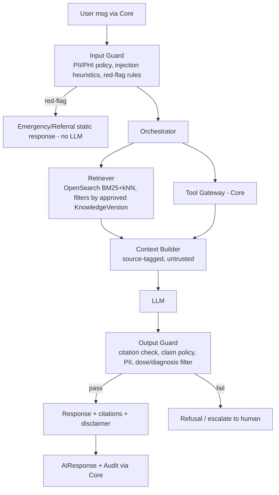

# 05 — AI Architecture

## 1. اصل بنیادی: «LLM مشورت می‌دهد، قواعد و انسان تصمیم می‌گیرند»
### LLM کجاست
LLM فقط داخل **AI Service** و فقط در این نقش‌هاست:
1. بازنویسی/خلاصه‌سازی و توضیح زبان طبیعی **بر پایهٔ متن بازیابی‌شده** (RAG).
2. فهم نیت پرسش (Intent classification) و انتخاب Tool.
3. استخراج ساخت‌یافته از متن/تصویر (پیشنهاد؛ همیشه Human-in-the-loop).
4. ترجمه/ساده‌سازی زبان برای بیمار.

### LLM کجا اجازهٔ تصمیم ندارد (ممنوع مطلق)
| موضوع | چه کسی تصمیم می‌گیرد |
|---|---|
| وجود/شدت تداخل دارویی، منع مصرف، آلرژی | **Clinical Rule Engine** (C#، قطعی) |
| تعیین/تغییر دوز، شروع/توقف دارو | پزشک (+ ابزار محاسبه قطعی در آینده) |
| تشخیص بیماری، triage نهایی | انسان؛ Red-flag فقط قاعده‌محور |
| ایجاد/تغییر نسخه، برنامه، مصرف، Consent، AccessGrant | فقط API با نیت صریح کاربر؛ AI حق نوشتن ندارد |
| تأیید ADR/علیت | داروساز/پزشک |
| Authorization و انتخاب کاربر/بیمار هدف | Core |
| انتشار دانش یا قاعده | Reviewer انسانی |
| ارسال داده به بیرون | Core/Integrations |
اگر LLM چیزی خارج از این‌ها بگوید، Output Guard آن را حذف یا پاسخ را با «امتناع + ارجاع به متخصص» جایگزین می‌کند.

## 2. اجزا

| جزء | توضیح |
|---|---|
| **Embedding** | مدل چندزبانه (فارسی/انگلیسی) — **UNKNOWN** مدل (D-17). نسخهٔ مدل جزو متادیتا ایندکس؛ تغییر مدل = reindex کامل. |
| **Vector Search** | OpenSearch k-NN (پیشنهاد؛ pgvector جایگزین، D-19). ترکیب Hybrid: BM25 + vector + rerank. فیلتر اجباری: `knowledge_version.status=Approved` و language. |
| **Knowledge Base** | فقط منابع تأییدشده و دارای مجوز (D-16). Chunk با حفظ ساختار (بخش، نسخه، صفحه). هر chunk → `source_id, doc_id, version_id, section`. |
| **RAG** | پاسخ فقط از Context؛ اگر Retrieval score < آستانه → «اطلاعات کافی نیست». الزام ارجاع به chunk. Prompt: متن بازیابی‌شده = *داده*، نه دستور. |
| **Clinical Rule Engine** | ماژول ClinicalRules در Core؛ AI فقط از طریق Tool `check_interactions` می‌خواند و نتیجه را **بی‌تغییر** نقل می‌کند (template-based، نه بازنویسی معنا). |
| **Tool Calling** | فقط Tool های allowlist، هر Tool: schema سخت‌گیر، پارامتر اعتبارسنجی‌شده در Core، توکن on-behalf-of کاربر، Consent-check، Audit، Rate-limit، بدون Tool نوشتاری در MVP. |
| **Safety Layer** | (۱) Red-flag rules (۲) Scope classifier (۳) Claim policy (۴) Age/pregnancy caution (۵) Disclaimer (۶) Kill-switch/Feature-flag. |
| **Guardrails** | Input: طول، فرمت، PII redaction، ضد-injection، ضد-jailbreak. Output: schema، ارجاع، ممنوعیت دوز/تشخیص، سازگاری با نتیجهٔ Rule Engine (در تضاد ⇒ Rule Engine برنده). |
| **Evaluation** | بخش ۵. |

## 3. Toolهای MVP (فقط‌خواندنی، پیشنهاد)
| Tool | خروجی | گارد |
|---|---|---|
| `search_knowledge(query, filters)` | chunkها + ارجاع | فقط Approved |
| `get_medication_info(medication_id)` | کاتالوگ | عمومی |
| `check_interactions(ingredient_ids | medication_ids)` | SafetyResult قطعی | Rule Engine |
| `get_my_schedule(range)` | برنامه بیمار جاری | فقط subject=خود کاربر یا AccessGrant معتبر |
| `get_my_adherence(range)` | خلاصه | همان |
| `escalate_to_human(reason)` | ایجاد Notification/Task | rate-limit |
Toolهای نوشتاری (ثبت مصرف با دستور طبیعی و …) **خارج از MVP**؛ در صورت افزودن: تأیید صریح کاربر در UI (نه در متن LLM).

## 4. مدل‌ها و تأمین‌کننده
- LLM Provider/مدل/مکان استقرار: **UNKNOWN** — [DECISION REQUIRED] D-17 (Cloud API در برابر Self-hosted؛ محدودیت ارسال PHI؛ قرارداد عدم‌آموزش روی داده؛ Region).
- طراحی **Provider-agnostic** (Interface `ILlmClient`/`LLMClient` + Adapter) تا تعویض ممکن باشد.
- پیش‌فرض ایمن: به LLM خارجی **هرگز** شناسه‌های مستقیم (نام، تلفن، کد ملی) ارسال نمی‌شود؛ Pseudonymization در Core قبل از ارسال؛ داده بالینی حداقلی (فقط لازم).
- Prompt و قالب‌ها نسخه‌دار در Git؛ تغییر = PR + Eval gate.

## 5. Evaluation (دروازهٔ Release)
| مجموعه | معیار | آستانه |
|---|---|---|
| Golden Q&A دارویی (فارسی/انگلیسی) | Groundedness/Faithfulness، Citation accuracy | UNKNOWN (D-26) |
| Refusal set (تشخیص، دوز، سؤال خارج دامنه) | Refusal recall | پیشنهاد ≥ 99% |
| Red-flag set | Recall (قاعده‌محور) | پیشنهاد 100% روی مجموعهٔ طلایی |
| Interaction consistency | AI نتیجهٔ Rule Engine را تغییر ندهد | 100% |
| Red-team / Prompt-injection | Attack success rate | پیشنهاد 0 روی مجموعهٔ شناخته‌شده |
| Retrieval | Recall@k, MRR | UNKNOWN |
| Latency/Cost | p95، توکن/پرسش | طبق NFR |
- Eval در CI برای تغییر prompt/مدل/ایندکس؛ نمونه‌برداری انسانی (داروساز) ماهانه؛ داده Eval بدون PHI واقعی.
- Monitoring: نرخ امتناع، نرخ فیلتر Output، بازخورد 👎، Drift ایندکس؛ Incident runbook برای پاسخ ناایمن + Kill-switch.

## 6. Knowledge Pipeline
Upload/Fetch (Provider) → ذخیره خام (Storage) → Malware/Type scan → Parse (PDF/HTML) → Normalize → Chunk → Embed →
Draft Index → **بازبینی انسانی دو نفره** → Approve → Alias `active` → Rollback ممکن. هر مرحله Audit.
مجوز/کپی‌رایت منبع باید قبل از ورود تأیید شود (D-16).

## 7. مرز شبکه/داده
AI Service: بدون اتصال به Postgres PHI؛ فقط Core API (mTLS + JWT کوتاه‌مدت)، OpenSearch (فقط ایندکس دانش عمومی)، LLM egress از طریق Proxy با allowlist. لاگ AI بدون متن خام کاربر مگر با redaction.

## 8. ریسک‌های AI (خلاصه؛ کامل در سند ۰۶)
هالوسینیشن، Prompt Injection (مستقیم/از طریق سند)، نشت PHI به Provider، استفاده بیمار از پاسخ به‌جای مراجعه به پزشک، سوگیری زبان فارسی/کیفیت ترجمه، وابستگی به Provider.
